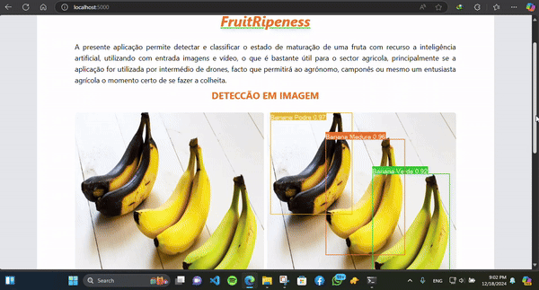

# Demostrativo da APP
### A presente aplicação permite detectar e classificar o estado de maturação de uma fruta com recurso a inteligência artificial, utilizando com entrada imagens e vídeo, o que é bastante útil para o sector agricola, principalmente se a aplicação for utilizada por intermédio de drones, facto que permitirá ao agrónomo, camponês ou mesmo um entusiasta agrícola o momento certo de se fazer a colheita.

